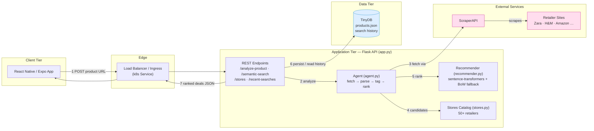

# Fashion Deal Recommender

A smart shopping assistant that helps users find the best deals on fashion items. This application allows users to input product URLs and finds similar items at better prices through web scraping technology.

## Features

- Product URL analysis and information extraction
- Automated web scraping for fashion products (ScraperAPI-backed)
- Semantic similarity recommendations across 50+ online stores
- Price comparisons and deal finding
- Clean and intuitive mobile interface

## Tech Stack

### Backend
- Python + Flask for the REST API
- BeautifulSoup4 for web scraping
- ScraperAPI integration for reliable data collection
- sentence-transformers for semantic similarity (with offline fallback)

### ML / Recommendations
- Semantic ranking of candidate products via sentence embeddings
  (`all-MiniLM-L6-v2`), with a deterministic bag-of-words cosine fallback
  so the service runs anywhere, even without the ML extras installed.
- Catalog of 50+ supported retailers (see `stores.py`).

### Frontend
- React Native/Expo mobile app
- Modern UI components
- Cross-platform compatibility

### CI/CD & Deployment
- GitHub Actions pipelines under `.github/workflows/` for linting, testing, and
  building the Docker image.
- Kubernetes manifests under `k8s/` for containerized deployment.

## Architecture



**Flow:** the mobile client sends a product URL to the Flask API. The **Agent**
(`agent.py`) orchestrates the pipeline — scrape the source page through **ScraperAPI**,
build a candidate set from the 50+ store catalog (`stores.py`), and rank alternatives by
semantic similarity via the **Recommender** (`recommender.py`). Search history is
persisted to **TinyDB** (`products.json`) and the ranked deals are returned to the client
as JSON.

Ranking uses `sentence-transformers` (`all-MiniLM-L6-v2`) when the optional ML extras are
installed, and falls back to a deterministic bag-of-words cosine so the service runs
anywhere. Set `FANOUT_SEARCH=1` to fan out across all stores in parallel for a wider
comparison set.

The tiers are decoupled (client ↔ API ↔ agent ↔ ML ↔ data), so each can scale or be
swapped independently — for example TinyDB → Postgres, or a vector database for
embeddings — without touching the others.

## API Endpoints

| Endpoint | Method | Purpose |
|---|---|---|
| `/` | GET | Health check |
| `/analyze-product` | POST | Analyze a product URL, return semantically ranked similar items |
| `/semantic-search` | POST | Rank candidate products by semantic similarity to a query |
| `/stores` | GET | List supported online stores (50+) |
| `/recent-searches` | GET | Last 10 searches |
| `/save-search` | POST | Persist a search |
| `/clear-history` | POST | Clear search history |

## Getting Started

### Prerequisites
- Python 3.8+
- Node.js and npm
- ScraperAPI account and API key

### Project Setup

1. Set up both backend and frontend in one command:
```bash
make setup
```

Or set up components individually:

### Backend Setup

1. Install Python dependencies:
```bash
make install
```

2. Configure ScraperAPI:
```bash
export SCRAPER_API_KEY='your_key_here'
```

   To enable transformer-based semantic similarity (optional):
```bash
pip install -r requirements-ml.txt
```

3. Start the backend server:
```bash
make run
```

### Frontend Setup

1. Install frontend dependencies:
```bash
make frontend
```

2. Start the development server:
```bash
make run-frontend
```

### Additional Make Commands

- `make help` - Show all available commands
- `make clean` - Clean up generated files and dependencies
- `make test` - Run the backend test suite
- `make lint` - Run flake8 linting
- `make format` - Format code with black

## How to Use

1. Open the mobile app
2. Paste a URL of a fashion item you like
3. Wait for the app to analyze the product
4. Browse through similar items and deals
5. Save your favorite finds

## Project Structure

```
.
├── app.py                # Flask REST API (endpoints, persistence)
├── agent.py              # Orchestrates fetch → parse → tag → rank
├── scraper.py            # Page fetching (ScraperAPI or plain requests)
├── recommender.py        # Semantic similarity ranking (+ offline fallback)
├── stores.py             # Catalog of 50+ supported retailers
├── requirements.txt      # Runtime dependencies
├── requirements-ml.txt   # Optional ML dependencies (sentence-transformers)
├── Dockerfile            # Container image
├── tests/                # pytest suite (agent, app, recommender, scraper)
├── k8s/                  # Kubernetes manifests
├── frontend/             # React Native (Expo) mobile app
│   ├── App.js            # Main screen
│   └── src/api.js        # Backend API client
└── .github/workflows/    # CI/CD pipeline
```

## Development

- Follow PEP 8 for Python code
- Use ESLint for JavaScript/React Native code
- Write tests for new features
- Keep the codebase clean and documented

## Contributing

1. Fork the project
2. Create your feature branch
3. Make your changes
4. Submit a pull request

## License

This project is licensed under the MIT License. See the [LICENSE](LICENSE) file for details.
