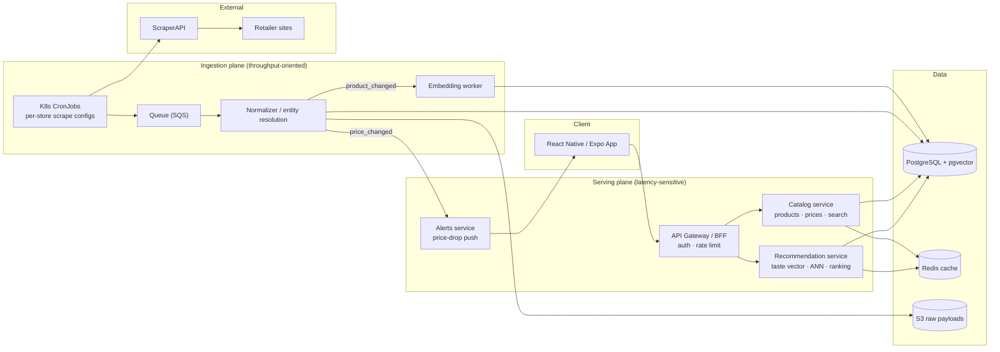

# Fashion Deal Recommender

A mobile shopping assistant that finds fashion deals matched to a user's taste. Kubernetes CronJobs scrape products from 50+ stores through ScraperAPI; a pipeline normalizes and deduplicates them into Postgres and vectorizes every product into pgvector. The recommendation service builds a per-user taste vector, runs approximate nearest-neighbor search over the catalog, and re-ranks by deal quality and freshness. The backend is a set of Flask services on AWS EKS; the client is a React Native (Expo) app.

## Features

- **Deal aggregation** — prices from 50+ fashion stores, refreshed daily (hot items more often).
- **Deal detection** — price drops versus an item's own history, plus cross-store price gaps for the same product.
- **Personalized feed** — deals ranked by semantic similarity to a user's taste, learned from clicks, saves, and purchases.
- **Search & wishlist** — browse the catalog, wishlist items, and get a push notification when a wishlisted item drops in price.
- **Semantic matching** — sentence-embedding similarity (`all-MiniLM-L6-v2`) with a deterministic bag-of-words fallback.

## Tech stack

| Layer | Stack |
|---|---|
| Mobile | React Native (Expo) · React Query · push notifications · OTA updates |
| API | Python · Flask · Gunicorn · JWT auth |
| Recommender | sentence-transformers (`all-MiniLM-L6-v2`) · pgvector (HNSW) · BoW fallback |
| Ingestion | ScraperAPI · BeautifulSoup · SQS · S3 |
| Data | PostgreSQL + pgvector · Redis |
| Infra | Docker · AWS EKS · GitHub Actions → ECR → Helm |

## Architecture

Two planes share a datastore but scale, fail, and deploy independently.

- **Serving plane (latency-sensitive):** React Native app → ALB → API gateway → {auth, catalog, recommendation, alerts} Flask services → Postgres/pgvector + Redis.
- **Ingestion plane (throughput-oriented):** Kubernetes CronJobs → ScraperAPI → raw payloads to S3 + SQS → normalizer / entity-resolution workers → Postgres → change events → embedding worker (pgvector) and alerts evaluator (push notifications).



**Flow:** a CronJob scrapes a store through ScraperAPI, drops raw HTML to S3 and a message to SQS. A normalizer maps store fields to the canonical schema, resolves the product against existing listings, and upserts the product plus a price point; `product_created` / `price_changed` events trigger the embedding worker (vectorize into pgvector) and the alerts service (notify matching wishlists). On the serving side, the recommendation service builds a per-user taste vector, runs approximate nearest-neighbor search over pgvector, and re-ranks candidates by deal quality and freshness.

## Design notes

- **Content-based similarity over collaborative filtering.** The catalog churns daily, so a brand-new deal has no interaction history exactly when it matters most; embedding every product at ingest sidesteps item cold-start.
- **Deal quality is a blend, not a raw discount.** Ranking combines semantic similarity with a deal score derived from each item's own trailing price-history median — which defends against fake "was" anchor prices — plus freshness.
- **Two decoupled planes.** Bursty batch scraping and steady low-latency serving have different scaling profiles, so ingestion and serving scale and fail independently while sharing the database.
- **Subtract where possible.** At ~1M-SKU scale, embeddings fit comfortably in pgvector, so the design avoids a separate vector database, Kafka, or a search cluster until scale demands them.

## API Endpoints

| Endpoint | Method | Purpose |
|---|---|---|
| `/` | GET | Health check |
| `/analyze-product` | POST | Analyze a product URL, return semantically ranked similar items |
| `/semantic-search` | POST | Rank candidate products by semantic similarity to a query |
| `/stores` | GET | List supported online stores (50+) |
| `/recent-searches` | GET | Last 10 searches |
| `/save-search` | POST | Persist a search |
| `/clear-history` | POST | Clear search history |

## Getting Started

### Prerequisites
- Python 3.8+
- Node.js and npm
- ScraperAPI account and API key

### Project Setup

1. Set up both backend and frontend in one command:
```bash
make setup
```

Or set up components individually:

### Backend Setup

1. Install Python dependencies:
```bash
make install
```

2. Configure ScraperAPI:
```bash
export SCRAPER_API_KEY='your_key_here'
```

   To enable transformer-based semantic similarity (optional):
```bash
pip install -r requirements-ml.txt
```

3. Start the backend server:
```bash
make run
```

### Frontend Setup

1. Install frontend dependencies:
```bash
make frontend
```

2. Start the development server:
```bash
make run-frontend
```

### Additional Make Commands

- `make help` - Show all available commands
- `make clean` - Clean up generated files and dependencies
- `make test` - Run the backend test suite
- `make lint` - Run flake8 linting
- `make format` - Format code with black

## Project Structure

```
.
├── app.py                # Flask REST API (endpoints, persistence)
├── agent.py              # Orchestrates fetch → parse → tag → rank
├── scraper.py            # Page fetching (ScraperAPI or plain requests)
├── recommender.py        # Semantic similarity ranking (+ offline fallback)
├── stores.py             # Catalog of 50+ supported retailers
├── requirements.txt      # Runtime dependencies
├── requirements-ml.txt   # Optional ML dependencies (sentence-transformers)
├── Dockerfile            # Container image
├── tests/                # pytest suite (agent, app, recommender, scraper)
├── k8s/                  # Kubernetes manifests
├── frontend/             # React Native (Expo) mobile app
│   ├── App.js            # Main screen
│   └── src/api.js        # Backend API client
└── .github/workflows/    # CI/CD pipeline
```

## License

This project is licensed under the MIT License. See the [LICENSE](LICENSE) file for details.
