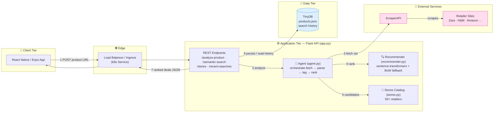

# Fashion Deal Recommender

A smart shopping assistant that helps users find the best deals on fashion items. This application allows users to input product URLs and finds similar items at better prices through web scraping technology.

## Features

- Product URL analysis and information extraction
- Automated web scraping for fashion products (ScraperAPI-backed)
- Semantic similarity recommendations across 50+ online stores
- Price comparisons and deal finding
- Clean and intuitive mobile interface

## Tech Stack

### Backend
- Python + Flask for the REST API
- BeautifulSoup4 for web scraping
- ScraperAPI integration for reliable data collection
- sentence-transformers for semantic similarity (with offline fallback)

### ML / Recommendations
- Semantic ranking of candidate products via sentence embeddings
  (`all-MiniLM-L6-v2`), with a deterministic bag-of-words cosine fallback
  so the service runs anywhere, even without the ML extras installed.
- Catalog of 50+ supported retailers (see `stores.py`).

### Frontend
- React Native/Expo mobile app
- Modern UI components
- Cross-platform compatibility

### CI/CD & Deployment
- GitHub Actions pipeline (`.github/workflows/ci.yml`): lint, test, then
  build and push the Docker image on merge to `main`.
- Kubernetes manifests under `k8s/` for deployment to AWS EKS.

## System Design



**Flow:** mobile client → load balancer → Flask API → Agent scrapes the source page through ScraperAPI → expands to a 50+ store candidate set → recommender ranks by semantic similarity → results persisted to TinyDB and returned to the client.

### Step-by-step explanation

1. **Client request** — The Expo app POSTs a product URL to `/analyze-product`. The mobile client is stateless and only renders results, keeping it portable across iOS/Android.
2. **Edge routing** — A Kubernetes `Service`/ingress fronts the API so traffic can be load-balanced across multiple Flask replicas, enabling horizontal scaling.
3. **Orchestration** — The API hands the URL to the **Agent** (`agent.py`), which owns the full pipeline: map URL → store, fetch, parse, tag, and rank. Keeping this in one place isolates business logic from transport.
4. **Scrape** — The Agent calls **ScraperAPI** (proxy/anti-bot) to fetch the retailer page reliably, then extracts product details with BeautifulSoup. ScraperAPI absorbs rate limits and IP blocking so the app doesn't have to.
5. **Candidate generation** — The **Stores catalog** (`stores.py`) supplies 50+ retailers. By default candidates come from links on the scraped page; with `FANOUT_SEARCH=1` the Agent fans out across all stores in parallel (`gather_candidates`) to widen the comparison set, then merges results.
6. **Semantic ranking** — The **Recommender** (`recommender.py`) embeds the source product and candidates with `sentence-transformers`, falling back to a deterministic bag-of-words cosine when ML extras aren't installed — so it runs anywhere.
7. **Persistence & response** — Search history is written to **TinyDB** (`products.json`) for recent-searches, and the ranked deals are returned to the client as JSON.

**Why this design:** the layers are decoupled (client ↔ API ↔ agent ↔ ML ↔ data), so each can scale or be swapped independently — e.g., TinyDB → Postgres, or a vector DB for embeddings — without touching the others.

### How it works (4 steps)

1. **Request** — the mobile app sends a product URL to the **Flask API**.
2. **Scrape** — the **Agent** fetches the page (via ScraperAPI) and extracts the
   product details.
3. **Rank** — it finds similar items across **50+ stores** and ranks them by
   **semantic similarity**.
4. **Respond** — results are saved to the **database** and returned to the app.

### What each part does

| Component | Role | Why it's there |
|---|---|---|
| 📱 **Mobile App** | React Native (Expo) frontend | Where the user pastes a product URL and views deals |
| ⚙️ **Flask API** | REST backend (`app.py`) | Receives requests, talks to the agent, returns JSON |
| 🧠 **Agent** | Core logic (`agent.py`) | Orchestrates scrape → extract → tag → (optional fan-out) → rank |
| 🏬 **Stores** | Catalog + search (`stores.py`) | Tags products by domain; can search 50+ stores in parallel |
| 🌐 **Retailer Sites** | External shops (Zara, H&M, Amazon…) | The live source of product data, fetched via ScraperAPI |
| 🔍 **Semantic Ranking** | ML matcher (`recommender.py`) | Scores how *similar* each candidate is to the source product |
| 💾 **Database** | TinyDB | Stores search history so users can revisit past searches |

### One-line summary

> A mobile app that finds similar fashion deals across 50+ stores by **scraping**
> product pages and ranking alternatives with **semantic similarity**.

## API Endpoints

| Endpoint | Method | Purpose |
|---|---|---|
| `/` | GET | Health check |
| `/analyze-product` | POST | Analyze a product URL, return semantically ranked similar items |
| `/semantic-search` | POST | Rank candidate products by semantic similarity to a query |
| `/stores` | GET | List supported online stores (50+) |
| `/recent-searches` | GET | Last 10 searches |
| `/save-search` | POST | Persist a search |
| `/clear-history` | POST | Clear search history |

## Getting Started

### Prerequisites
- Python 3.8+
- Node.js and npm
- ScraperAPI account and API key

### Project Setup

1. Set up both backend and frontend in one command:
```bash
make setup
```

Or set up components individually:

### Backend Setup

1. Install Python dependencies:
```bash
make install
```

2. Configure ScraperAPI:
```bash
export SCRAPER_API_KEY='your_key_here'
```

   To enable transformer-based semantic similarity (optional):
```bash
pip install -r requirements-ml.txt
```

3. Start the backend server:
```bash
make run
```

### Frontend Setup

1. Install frontend dependencies:
```bash
make frontend
```

2. Start the development server:
```bash
make run-frontend
```

### Additional Make Commands

- `make help` - Show all available commands
- `make clean` - Clean up generated files and dependencies
- `make test` - Run both backend and frontend tests

## How to Use

1. Open the mobile app
2. Paste a URL of a fashion item you like
3. Wait for the app to analyze the product
4. Browse through similar items and deals
5. Save your favorite finds

## Project Structure

```
.
├── app.py                # Flask REST API (endpoints, persistence)
├── agent.py              # Orchestrates fetch → parse → tag → rank
├── scraper.py            # Page fetching (ScraperAPI or plain requests)
├── recommender.py        # Semantic similarity ranking (+ offline fallback)
├── stores.py             # Catalog of 50+ supported retailers
├── requirements.txt      # Runtime dependencies
├── requirements-ml.txt   # Optional ML dependencies (sentence-transformers)
├── Dockerfile            # Container image
├── tests/                # pytest suite (agent, app, recommender, scraper)
├── k8s/                  # Kubernetes manifests for AWS EKS
├── frontend/             # React Native (Expo) mobile app
│   ├── App.js            # Main screen
│   └── src/api.js        # Backend API client
└── .github/workflows/    # CI/CD pipeline
```

## Development

- Follow PEP 8 for Python code
- Use ESLint for JavaScript/React Native code
- Write tests for new features
- Keep the codebase clean and documented

## Contributing

1. Fork the project
2. Create your feature branch
3. Make your changes
4. Submit a pull request

## License

MIT License - feel free to use and modify the code as you wish
